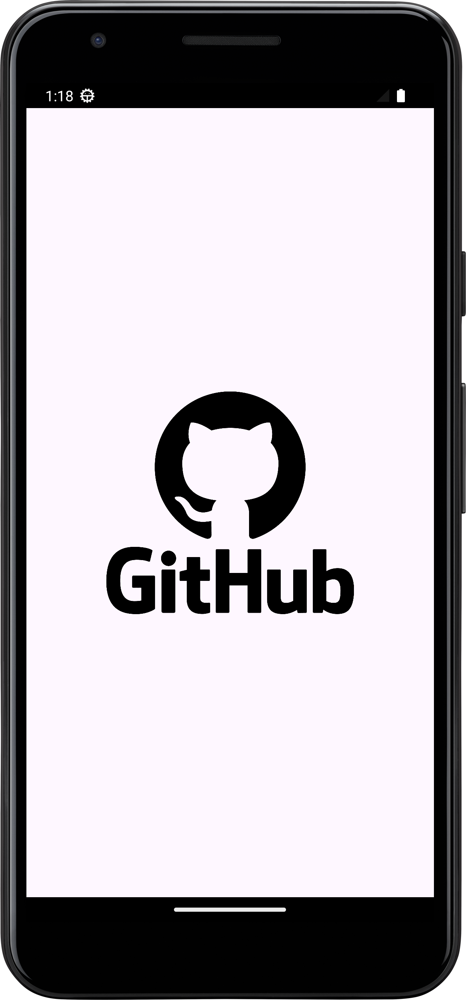
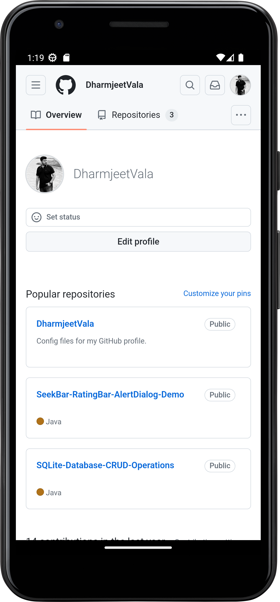

# WebView Example in Kotlin
This is a simple Android application that demonstrates the use of `WebView` to load and display the GitHub website. The project is implemented in Kotlin.
# Features

- Loads the GitHub website in a WebView.
- Shows a ProgressBar while the page is loading.
- Handles errors and displays a Toast message if the page fails to load.
- Manages navigation within the WebView.

       
# Tools used

- Android Studio
- Android device or emulator running API level 21 or higher
  
# How to install?

- Step:1
    - Clone the repository:

```
git clone https://github.com/DharmjeetVala/WebView-Example-Kotlin.git
```
- Step:2
    - Open the project in Android Studio.
- Step:3 
    - Build and run the project on an Android device or emulator.

# Preview:
<div style="display: flex; flex-wrap: wrap; gap: 30px;">
  
  
  
</div>
<br/><br/>
Thanks

Regards ~ Dharmjeet Vala


